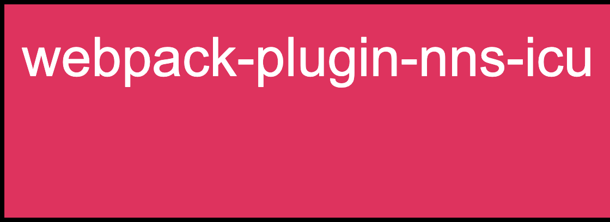
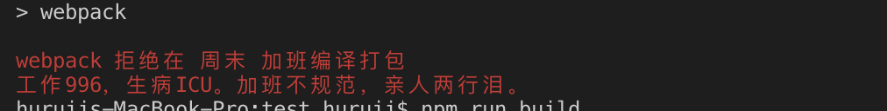
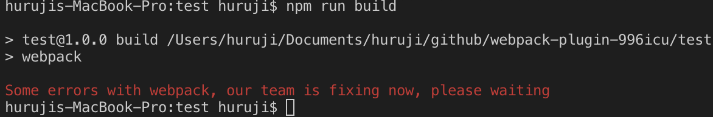

<p>

<p>




一个帮助前端开发者，拒绝 996，提高工作效率的 webpack 插件

> 这个插件在非工作时间将使 webpack 拒绝编译打包

## 使用

```bash
npm i webpack-plugin-nns-icu -D
```

> nns 为 996 英文首字母缩写

```js
// webpack.config.js
const WebpackPlugin996ICU = require('webpack-plugin-nns-icu')

const config = {
  // other config options
  plugins: [
    new WebpackPlugin996ICU()
  ]
}
```

## 参数

### focusWork
type: `boolean`

default: `false`

设置为 `true` 时，`996icu` 插件失效，任何时候都能打包成功

### type
type: `normal` | `webpack`

设置为 `webpack` 时，输入的报错信息会假装是 `webpack` 除了问题，报错内容如下：



### message
type: string

自定义报错信息

### holiday
type: `boolean`
default: `false`

设置为 `true` 时，会把当天当做休息日，应对周中假期情况

